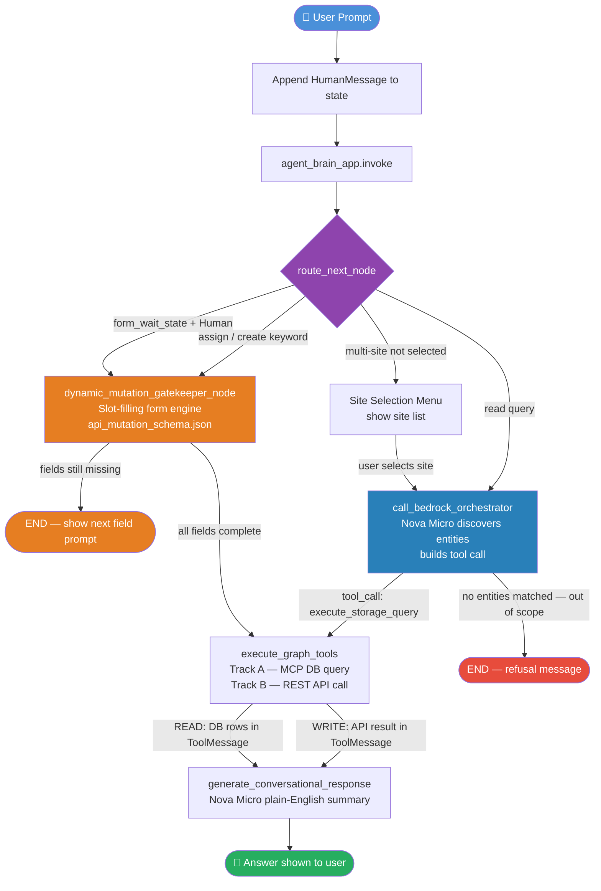

# Noke FM Chat — Agent Workflow Diagram

## Node Descriptions

| Node | Role |
|---|---|
| `route_next_node` | Central traffic controller — inspects state and decides the next node |
| `call_bedrock_orchestrator` | Calls Amazon Nova Micro to identify DB entities and build a tool call |
| `execute_graph_tools` | **Track A** runs an MCP/DB query; **Track B** calls a REST API mutation |
| `generate_conversational_response` | Synthesises raw DB/API results into a plain-English answer |
| `dynamic_mutation_gatekeeper_node` | Slot-filling form engine driven by `api_mutation_schema.json` |
| `trigger_site_selection` | Displays an interactive site-picker menu when the user has multiple sites |

## Scenario Quick Reference

| User says | Track | Key nodes |
|---|---|---|
| "How many active units?" | Read / Aggregation | orchestrator → execute_tools (MCP) → synthesis |
| "What is the status of unit LA879?" | Read / Retrieval | orchestrator → execute_tools (MCP) → synthesis |
| "Assign a unit?" | Write / Form | gatekeeper (multi-turn) → execute_tools (REST API) → synthesis |
